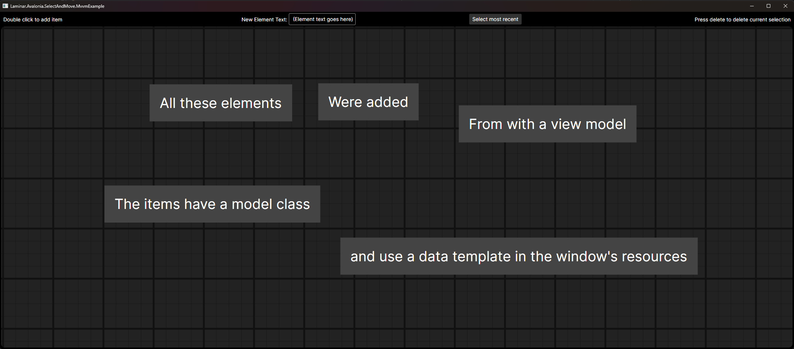

# Laminar.Avalonia.SelectAndMove

SelectAndMove is a lightweight, modular Avalonia control for selecting and moving controls. 

## Provided Examples

### Customisation of SelectAndMove behavior
There are two [examples](examples) provided in SelectAndMove, the first is a range of controls added directly via the xaml and the Items collection. This example has no code behind or data context, and exposes several controls that are bound directly to the various properties of SelectAndMove

[See source code for this example](examples/Laminar.Avalonia.SelectAndMove.Example/MainWindow.axaml)

### MVVM Bindings
The second example is a more practical use, where the items are set via the ItemsSource property, which targets a list of item models on the view model, and uses a data template for those items. Selecting, adding, and deleting items all get redirected via the view model.

[See source code for this example](examples/Laminar.Avalonia.SelectAndMove.MvvmExample/MainWindow.axaml)
## Implementation Details
SelectAndMove is an ItemsControl with custom pan, zoom, select, move, and marquee select functionality. The template for SelectAndMove depends on Panel#PART_TransformRoot, which is the visual that is transformed when the ViewZoom, ViewTranslateX, and ViewTranslateY properties are changed.

Selection and marquee selection are gestures that work within a custom selection system that be applied to any control. These scopes are an independent system from the SelectAndMove class; any controls in the logical tree can define themselves as SelectionScopes and any control can be selected.

Move is also a gesture, but it specifically sets the Canvas.Left and Canvas.Top properties of the selected elements.

[BackgroundGridLines.cs](src/Laminar.Avalonia.SelectAndMove/BackgroundGridLines.cs) is a self-contained control whose visual depends on its RenderTransform with respect to a specified visual ancestor (by default its TemplatedParent, or its logical parent if its TemplatedParent doesn't exist). In the context of SelectAndMove, it provides gridlines that automatically adapt to the current zoom level and that the move gesture can snap to.

## Remarks
A SelectingItemsControl may be more appropriate for a future version, but the base functionality of that class would need changing a lot to work within this system. 

Thanks to the [PanAndZoom](https://github.com/wieslawsoltes/PanAndZoom) for name and code inspiration. If all you need is the Pan and Zoom functionality, PanAndZoom may be easier to use.

## Resources
[GitHub Repository](https://github.com/Adam-Wilkinson/Laminar.Avalonia.SelectAndMove)

[NuGet Package](https://www.nuget.org/packages/Laminar.Avalonia.SelectAndMove/2.3.2)

## License

SelectAndMove is licensed under the [MIT license](LICENSE.TXT)
