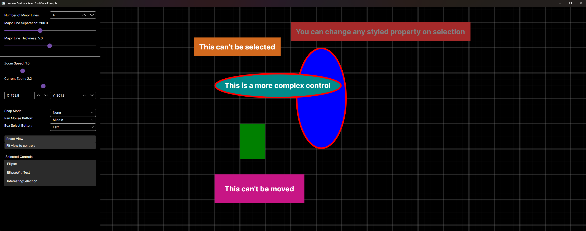

# Laminar.Avalonia.SelectAndMove

SelectAndMove is a lightweight, modular Avalonia control for selecting and moving controls. 

[See source code for this example](examples/Laminar.Avalonia.SelectAndMove.Example/MainWindow.axaml)

## Implementation Details
The core SelectAndMove class is a Canvas with several GestureRecognisers that manage the select, move, and box select gestures. These gestures can go on any control and operate on a selection scope system, but move requires a canvas. This also allows for functionality to be easily extended by adding additional GestureRecognizers. Pan and zoom functionality are managed through the RenderTransform of the ItemsPanelRoot, and are exposed through pointer interaction as well as ViewZoom, ViewTranslateX, and ViewTranslateY properties.

Also provided is a BackgroundGridLines class which is designed to be added as a child to the SelectAndMove canvas. It adds grid lines that automatically adjusts to the current zoom level, and provides a "SnapGrid" property that can be bound to the SelectAndMove canvas to snap controls to the grid lines (shown in the [example](examples/Laminar.Avalonia.SelectAndMove.Example/MainWindow.axaml))

Thanks to the [PanAndZoom](https://github.com/wieslawsoltes/PanAndZoom) for name and code inspiration. If all you need is the Pan and Zoom functionality, PanAndZoom may be easier to use.

## Resources
[GitHub Repository](https://github.com/Adam-Wilkinson/Laminar.Avalonia.SelectAndMove)

[NuGet Package](https://www.nuget.org/packages/Laminar.Avalonia.SelectAndMove/1.1.0)

## License

SelectAndMove is licensed under the [MIT license](LICENSE.TXT)
